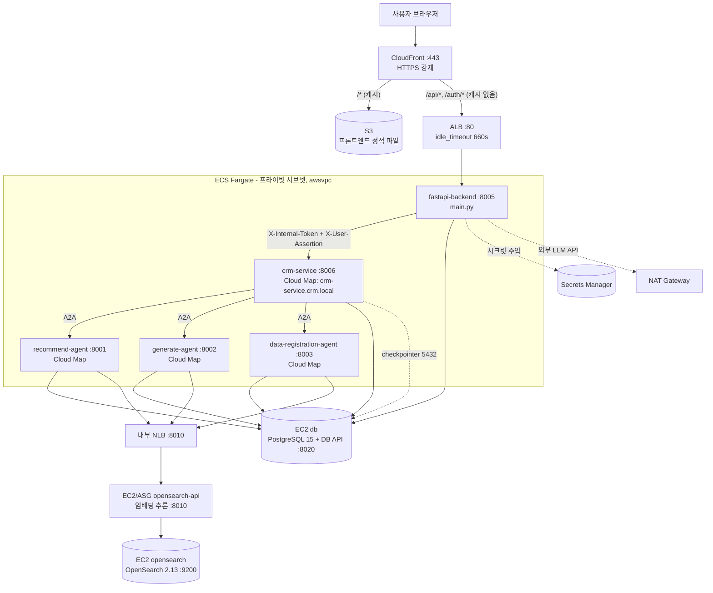

# AI Innovation Challenge 2026 — 페르소나 기반 뷰티 CRM 시스템

> 본 문서는 `backend / database / frontend / opensearch` 4개 애플리케이션 모듈과 `infra/ec2`(Terraform) / `.github/workflows`(CI·CD) 의 실제 소스 코드를 분석하여, **프로덕션(AWS) 배포 환경을 기준**으로 작성되었습니다. 로컬 Docker Compose 개발 환경과의 차이는 각 장의 "로컬 차이" 안내와 14장에 별도로 정리했습니다.
> 확인되지 않은 항목은 "파일에서 확인되지 않음"으로 표기했습니다.

## 목차

1. [프로젝트 개요](#1-프로젝트-개요)
2. [전체 아키텍처](#2-전체-아키텍처)
3. [디렉토리 구조](#3-디렉토리-구조)
4. [백엔드 구조 상세](#4-백엔드-구조-상세)
5. [데이터베이스 구조 상세](#5-데이터베이스db-구조-상세)
6. [VectorDB(OpenSearch) 구조 상세](#6-vectordbopensearch-구조-상세)
7. [프론트엔드 구조 상세](#7-프론트엔드-구조-상세)
8. [메시지 입력 → 응답 전체 흐름](#8-메시지-입력--응답-전체-흐름)
9. [로그인 / 인증 흐름](#9-로그인--인증-흐름)
10. [데이터 저장 흐름](#10-데이터-저장-흐름)
11. [프로덕션 인프라 아키텍처 (AWS)](#11-프로덕션-인프라-아키텍처-aws)
12. [CI/CD 배포 파이프라인](#12-cicd-배포-파이프라인)
13. [환경 변수 및 설정](#13-환경-변수-및-설정)
14. [로컬 개발 환경 (Docker Compose)](#14-로컬-개발-환경-docker-compose)

---

## 1. 프로젝트 개요

**페르소나 기반 뷰티 상품 추천 및 CRM 메시지 자동 생성 시스템**입니다. 사용자가 채팅으로 "특정 페르소나에게 어떤 상품의 홍보 메시지를 만들어줘"라고 요청하면, LangGraph 멀티에이전트 백엔드가 ① 요청을 분석하여 라우팅하고 ② OpenSearch 하이브리드 검색으로 페르소나에 맞는 상품을 추천하며 ③ 추천 상품에 대한 마케팅 메시지를 생성하고 ④ 3단계 품질 검사를 통과한 메시지만 DB에 저장합니다. 페르소나·상품 데이터를 텍스트/파일로 등록하는 데이터 등록 파이프라인도 포함합니다. 응답은 SSE(Server-Sent Events)로 실시간 스트리밍됩니다.

### 주요 기술 스택

| 영역 | 기술 |
|------|------|
| 언어 | Python 3.11 (백엔드/DB/검색), JavaScript (프론트엔드) |
| 백엔드 프레임워크 | FastAPI, LangGraph, LangChain, A2A(Agent-to-Agent) 커스텀 프로토콜 |
| LLM | OpenAI (`gpt-5-mini` / `gpt-5-nano` 기본값), Anthropic Claude, Google Gemini 선택 가능 (`ALLOWED_MODEL_PREFIXES`로 화이트리스트) |
| 임베딩 모델 | `nlpai-lab/KURE-v1` (SentenceTransformer, 한국어) |
| 벡터 검색 | OpenSearch (BM25 + KNN 하이브리드, nori 한국어 형태소 분석) |
| RDB | PostgreSQL 14+ (SQLAlchemy 2.0 ORM) |
| 체크포인터 | LangGraph `AsyncPostgresSaver` (PostgreSQL) |
| 인증 | JWT (HttpOnly Cookie) + 서비스 간 `INTERNAL_TOKEN` + 단명 User Assertion JWT |
| 프론트엔드 | React 19, Vite 7, React Router 7, styled-components, axios |
| 관측성 | structlog (JSON 구조화 로그), LangSmith 트레이싱(선택) |
| 인프라(프로덕션) | AWS — CloudFront+S3(프론트), ALB+ECS Fargate(앱 5종), EC2(DB/OpenSearch/OpenSearch API), Terraform(`infra/ec2/`), GitHub Actions OIDC 배포 |
| 인프라(로컬 개발) | Docker Compose (모듈별), Nginx(프론트 정적 서빙) |

---

## 2. 전체 아키텍처

> 이 장은 **프로덕션(AWS) 토폴로지를 기준**으로 설명합니다. 로컬 개발 시에는 4개 Docker Compose 스택(backend/database/frontend/opensearch)이 동일한 서비스를 컨테이너로 띄우며, 차이점은 각 절 끝의 "로컬 차이" 안내와 14장에 정리했습니다.

논리적으로는 **5개의 FastAPI 마이크로서비스**(API Gateway·CRM·Recommend·Generate·Data Registration) + **DB API** + **OpenSearch API**로 구성되지만, 프로덕션에서는 이들이 두 종류의 컴퓨팅 위에서 실행됩니다 — FastAPI 5종은 **ECS Fargate**, DB·OpenSearch·OpenSearch API는 **EC2**. 외부에 노출되는 경로는 **CloudFront(프론트엔드 정적 파일 + API 진입점)** 하나뿐입니다.

| 컴포넌트 | 포트 | 실행 위치(프로덕션) | 노출 |
|----------|------|---------------------|------|
| CloudFront + S3 (프론트엔드) | 443 | CloudFront / S3 정적 호스팅 | **외부 공개** |
| API Gateway (Auth + BFF Proxy) | 8005 | ECS Fargate (`fastapi-backend`) | ALB 경유 **외부 공개** |
| CRM Service (Supervisor 오케스트레이터) | 8006 | ECS Fargate (`crm-service`) | VPC 내부 (Cloud Map) |
| Recommend Agent | 8001 | ECS Fargate (`recommend-agent`) | VPC 내부 (Cloud Map) |
| Generate Agent | 8002 | ECS Fargate (`generate-agent`) | VPC 내부 (Cloud Map) |
| Data Registration Agent | 8003 | ECS Fargate (`data-registration-agent`) | VPC 내부 (Cloud Map) |
| Database API | 8020 | EC2 `db` (PostgreSQL과 동일 인스턴스) | VPC 내부 (private IP) |
| OpenSearch API | 8010 | EC2 `opensearch_api` (ASG, 별도 분리) | VPC 내부 (NLB 또는 private IP) |
| OpenSearch 엔진 | 9200 | EC2 `opensearch` | VPC 내부 (opensearch-api EC2에서만 접근) |
| PostgreSQL | 5432 | EC2 `db` | VPC 내부 (ECS에서만 접근) |



**핵심 통신 규칙**
- 브라우저 → CloudFront: HTTPS 강제(`redirect-to-https`). `/*`(기본)는 S3 OAC로 정적 파일 서빙(캐시 O), `/api/*`·`/auth/*`는 ALB로 캐시 없이 전달(쿠키·헤더 모두 forward).
- ALB → ECS `fastapi-backend`(8005)만 타깃 그룹에 연결 — 나머지 4개 서비스는 ALB에 노출되지 않음. `idle_timeout=660s`로 SSE 스트리밍이 `graph_execution_timeout`(600s)보다 먼저 끊기는 504 경쟁 조건을 방지.
- ECS 서비스 간: 컨테이너명이 아니라 **AWS Cloud Map**(`crm.local` 네임스페이스) DNS로 통신(예: `http://crm-service.crm.local:8006`). Gateway → CRM은 **`X-Internal-Token`** 헤더(서비스 간 공유 비밀) + 인증된 사용자 정보를 **`X-User-Assertion`** 단명 JWT(30초)로 전달. raw `X-User-Id` 헤더를 신뢰하지 않음(IDOR 방어).
- CRM Service → 서브에이전트: **A2A 프로토콜**(`backend/a2a/`) HTTP POST `/tasks/send`, 502/503/504와 연결 오류(`httpx.RequestError`/`TimeoutException`) 모두 지수 백오프 재시도.
- ECS → EC2(DB·OpenSearch API): 컨테이너 서비스명이 아니라 **EC2 private IP**(또는 `opensearch_api_use_nlb=true`면 내부 NLB DNS)를 직접 호출. EC2 간(`opensearch-api`→`opensearch` 9200)은 보안그룹으로 ECS의 직접 접근을 차단(인증 없는 네이티브 포트 보호).
- 인프라 상세(VPC·보안그룹·Secrets Manager·백업·CI/CD)는 11~12장 참고.

> **로컬 차이**: Docker Compose 환경은 4개 독립 스택이 `msa-net`이라는 단일 Docker 브리지 네트워크에서 컨테이너명으로 서로를 호출하며, 외부 노출은 API Gateway(8005)와 Frontend(3000) 두 포트뿐입니다. CloudFront/ALB/ECS/EC2/NAT 같은 AWS 구성요소는 로컬에 존재하지 않습니다. 14장 참고.

---

## 3. 디렉토리 구조

### backend/

```
backend/
├── main.py                       # API Gateway(8005) 진입점 — 인증·BFF 프록시·Rate Limiter 초기화
├── docker-compose.yml            # 5개 백엔드 서비스 정의 (msa-net external network)
├── Dockerfile
├── a2a/                          # Agent-to-Agent 내부 통신 프로토콜
│   ├── client.py                 # A2AClient — /tasks/send POST, 재시도, X-Internal-Token
│   ├── models.py                 # Task, TaskStatus, Message, DataPart 등 프로토콜 모델
│   └── serialization.py          # LangChain 메시지 ↔ dict 직렬화
├── servers/                      # 각 마이크로서비스 진입점
│   ├── crm_server.py             # CRM Supervisor(8006) — 체크포인터/업로드잡 테이블 셋업
│   ├── recommend_server.py       # 상품 추천 에이전트(8001)
│   ├── generate_server.py        # 메시지 생성 에이전트(8002)
│   └── data_registration_server.py # 데이터 등록 에이전트(8003)
├── app/
│   ├── .env.example              # 백엔드 환경변수 템플릿
│   ├── config/settings.py        # Pydantic Settings 싱글턴 (모든 설정 중앙 관리 + 시작 시 검증)
│   ├── api/                      # FastAPI 라우터
│   │   ├── auth_router.py        # /auth/* (회원가입·로그인·refresh·logout·me·admin)
│   │   ├── crm_proxy.py          # /api/marketing/*, /api/pipeline/* → CRM(8006) BFF 프록시
│   │   ├── db_proxy.py           # /api/conversations·personas·products·generated-messages → DB(8020) 프록시
│   │   ├── marketing_api.py      # /api/marketing/chat/v2(+/stream) — 에이전트 호출 본체(CRM 측)
│   │   ├── persona_pipeline.py   # /api/pipeline/personas/* — 텍스트/파일 페르소나 생성
│   │   ├── products_pipeline.py  # /api/pipeline/products/* — 상품 등록
│   │   ├── upload_jobs.py        # /api/.../jobs/{id}/stream — 백그라운드 업로드 잡 SSE
│   │   └── deps.py               # 공용 의존성 (get_current_user, require_admin, Rate Limiter 주입)
│   ├── core/                     # 인프라 계층
│   │   ├── auth.py               # AuthProvider (jwt | api_key 전환) + UserContext
│   │   ├── auth_utils.py         # User Assertion JWT 생성·검증 (서비스 간 사용자 전달)
│   │   ├── internal_auth.py      # X-Internal-Token 검증 미들웨어
│   │   ├── security.py           # bcrypt_sha256 해싱, access/refresh 토큰 발급
│   │   ├── rate_limiter.py       # PostgreSQL 기반 Rate Limiter
│   │   ├── database.py           # SQLAlchemy 동기 엔진/세션
│   │   ├── llm_factory.py        # get_llm(model, temperature)
│   │   ├── llm_utils.py          # ainvoke_with_retry — 공용 LLM 재시도(provider 무관)+세마포어+Full Jitter 백오프
│   │   ├── logging.py            # structlog 설정, AgentLogger, get_logger
│   │   ├── middleware.py         # 요청 로깅 미들웨어
│   │   ├── body_limit.py         # 바디 크기 제한 미들웨어
│   │   ├── models.py             # ORM 모델(User, RefreshToken, Conversation 등)
│   │   ├── cleanup.py            # 만료 토큰·오래된 체크포인트 정리
│   │   └── data_loader.py        # forbidden_keyword·brand_tone 정적 설정 로드/검증
│   └── agents/                   # LangGraph 에이전트
│       ├── crm_message_agent/    # ★ Supervisor 오케스트레이터 (메인 그래프)
│       │   ├── crm_message_agent.py # chat() / chat_stream() — SSE 이벤트 생성
│       │   ├── workflow.py       # StateGraph 빌드 (maybe_summarize→supervisor→서브에이전트)
│       │   ├── nodes.py          # supervisor_agent, search_agent, A2A 노드 팩토리
│       │   ├── state.py          # CRMMessageAgentState (turn-scope reducer 포함)
│       │   └── prompts/          # supervisor / summary 프롬프트
│       ├── recommend_product_agent/  # 상품 추천 서브그래프
│       │   ├── workflow.py       # init→parser→get_search_query→recommend_products
│       │   ├── nodes.py
│       │   └── services/recommend_product_in_persona.py # RRF 융합 추천 로직
│       ├── generate_message_agent/   # 메시지 생성 서브그래프
│       │   ├── workflow.py       # init→router→generate→quality_check↔feedback→output
│       │   └── services/         # generate_crm_message, quality_check(3단계), apply_feedback
│       ├── data_registration_agent/  # 페르소나/상품 데이터 등록 서브그래프
│       ├── shared/               # 공용 클라이언트
│       │   ├── persona/persona_client.py   # DB API 호출 (페르소나 저장/조회)
│       │   ├── product/product_client.py   # DB+OpenSearch API 호출 (상품 검색)
│       │   └── parser_and_router/          # 요청 파서
│       └── tools/                # search_tools(검색 도구), handoff_tools, ranking/formatters
└── scripts/create_admin.py       # 관리자 계정 생성 스크립트
```

### database/

```
database/
├── api_server.py                 # Database API(8020) — InternalToken·바디제한 미들웨어 + 3개 라우터
├── docker-compose.yml            # PostgreSQL + pgAdmin + DB API
├── alembic.ini                   # Alembic 마이그레이션 설정
├── requirements.txt
├── core/
│   ├── database.py               # SQLAlchemy 엔진/세션
│   ├── models.py                 # ORM 모델 (Persona, Product, Conversation, GeneratedMessage 등)
│   ├── pagination.py             # 페이지네이션 기본값/상한 상수
│   └── logging.py                # structlog + RequestLoggingMiddleware
├── routers/
│   ├── api_endpoints.py          # /api/personas·products·product-search-queries (POST 위주)
│   ├── conversations_router.py   # /api/conversations CRUD
│   ├── generated_messages_router.py # /api/generated-messages 조회/필터/삭제
│   └── auth_utils.py             # get_request_user_id (X-User-Assertion 검증)
├── init/                         # 컨테이너 최초 기동 시 실행되는 SQL
│   ├── 01-create-tables.sql      # personas, products, conversations, generated_messages 등
│   ├── 02-auth-tables.sql        # users, refresh_tokens (+ updated_at 트리거)
│   ├── 03-add-persona-user-id.sql
│   ├── 04-add-updated-at-trigger.sql
│   ├── 05-add-account-lockout.sql
│   ├── 06-add-rate-limits.sql    # rate_limits 테이블 (PostgresRateLimiter)
│   └── 07-add-persona-seq.sql    # persona_seq 시퀀스 (PERSONA_00001 형식)
├── migrations/                   # Alembic 버전 디렉토리
├── scripts/                      # 데이터 적재/마이그레이션 스크립트
│   ├── insert_personas.py
│   ├── insert_products_from_jsonl.py
│   ├── jsonl_to_sql_new.py
│   ├── setup_pipeline.py         # DB 초기 셋업 파이프라인
│   └── ...
└── data/product_data_for_db.jsonl
```

### frontend/

```
frontend/
├── package.json                  # React 19, Vite 7, axios, react-router-dom 7, styled-components
├── vite.config.js
├── nginx.conf                    # 프로덕션 정적 서빙 설정
├── Dockerfile / docker-compose.yml
├── .env.example                  # VITE_AUTH_API_URL, VITE_API_URL
├── index.html
└── src/
    ├── main.jsx                  # React 진입점
    ├── App.jsx                   # 라우팅 + Provider 트리 (Auth/Chat/Toast) + ProtectedRoute
    ├── api.jsx                   # axios 인스턴스 2종 (authApi, api) + 401 refresh 인터셉터
    ├── context/
    │   ├── AuthContext.jsx       # 로그인/로그아웃/세션복원 (쿠키 기반)
    │   └── ChatContext.jsx       # 대화 목록·진행중 대화 상태 관리
    ├── components/
    │   ├── Layout.jsx            # 공통 레이아웃
    │   ├── Sidebar.jsx           # 대화 목록 사이드바
    │   └── Toast.jsx             # 토스트 알림 Provider
    ├── pages/
    │   ├── Login.jsx             # 로그인 페이지
    │   ├── Home.jsx              # 홈
    │   ├── Message.jsx           # ★ 메인 채팅 화면 — SSE 파싱, 상품카드, 메시지 생성
    │   ├── Persona.jsx           # 페르소나 등록/목록
    │   ├── Products.jsx          # 상품 등록/목록
    │   ├── GeneratedMessages.jsx # 생성된 메시지 보관함
    │   └── Settings.jsx          # 설정
    └── data/
        ├── brands.json           # 브랜드 목록(드롭다운)
        └── categories.json       # 카테고리 목록(드롭다운)
```

### opensearch/

```
opensearch/
├── opensearch_api.py             # OpenSearch API(8010) — 하이브리드 검색 엔드포인트 + InternalToken
├── opensearch_hybrid.py          # OpenSearchHybridClient — KURE-v1 임베딩, 하이브리드 쿼리, RRF 파이프라인
├── docker-compose.yml            # OpenSearch 엔진 + 검색 API
├── Dockerfile.opensearch / Dockerfile.api
├── .env.example                  # OPENSEARCH_HOST/PORT/PASSWORD, INTERNAL_TOKEN
├── requirements.txt
├── setup_opensearch.py           # 인덱스/파이프라인 초기 셋업
├── run_indexing_pipeline.py      # v3 전체 카테고리 색인 파이프라인 (skincare 먼저 → 인덱스 생성)
├── index_products_v4_multivector.py # v4 멀티벡터(문장단위 5필드) 색인
├── index_products_*.py           # 카테고리별 색인 스크립트 (skincare/hair/color_tone/...)
├── merge_product_data.py / export_product_ids.py / delete_index.py
└── path_utils.py
```

### infra/ (프로덕션 AWS 인프라 — Terraform)

```
infra/
├── bootstrap/                     # CI/CD 전제 리소스 (ECR 등) — ec2/ 보다 먼저 적용
│   ├── ecr.tf                     # 5개 서비스 ECR 레포지토리(이미지는 backend 하나를 5개 레포에 태그 복제)
│   ├── main.tf / variables.tf / outputs.tf
└── ec2/                           # 운영 인프라 본체
    ├── backend.tf                 # Terraform S3 state backend + DynamoDB lock
    ├── variables.tf               # 전체 변수(인스턴스 타입/CIDR/시크릿/ASG 등)
    ├── outputs.tf                 # ALB DNS, EC2 private IP, Cloud Map 네임스페이스 등
    ├── vpc.tf                     # VPC, 퍼블릭/프라이빗 서브넷, 라우팅 테이블
    ├── nat_gateway.tf              # 단일 NAT GW — 프라이빗 서브넷 아웃바운드(LLM API 호출)
    ├── vpc_endpoints.tf           # ECR/S3/Secrets Manager/CloudWatch Logs Interface/Gateway Endpoint
    ├── security_groups.tf         # ALB/ECS/DB EC2/OpenSearch EC2/OpenSearch API EC2/VPC Endpoint SG
    ├── alb.tf                     # ALB(idle_timeout 660s), backend 타깃그룹, 5xx 경보
    ├── cloudfront.tf              # CloudFront + S3(OAC) 프론트엔드 + /api,/auth → ALB 라우팅
    ├── ecs.tf                     # ECS Fargate 클러스터, 5개 태스크 정의/서비스, Cloud Map
    ├── ec2.tf                     # DB/OpenSearch/OpenSearch API EC2, EBS 데이터 볼륨(prevent_destroy)
    ├── opensearch_api_asg.tf      # OpenSearch API ASG(골든 AMI, CPU 타깃 트래킹)
    ├── opensearch_api_nlb.tf      # OpenSearch API용 내부 NLB
    ├── secrets.tf                 # Secrets Manager(admin seed, DB/JWT/INTERNAL_TOKEN/LLM API 키)
    ├── backup.tf                  # DLM EBS 일일 스냅샷(7일 보관)
    ├── ecr.tf                     # (bootstrap으로 이동됨 — 주석만 남음)
    └── user_data/                 # EC2 부트스트랩 스크립트(db_server.sh, opensearch_*_server.sh 등)
```

### .github/workflows/ (CI/CD)

```
.github/workflows/
├── deploy.yml                     # main 푸시 시 전체 배포 파이프라인 (12.1절 상세)
└── snapshot.yml                   # OpenSearch 스냅샷 등 별도 스케줄 작업
```

---

## 4. 백엔드 구조 상세

### 4.1 프레임워크 및 실행 진입점

백엔드는 **FastAPI 기반 5개 마이크로서비스**입니다. 각 서비스는 `lifespan` 컨텍스트에서 리소스(HTTP 클라이언트, DB 풀, Rate Limiter, LangGraph 그래프)를 한 번만 초기화합니다.

- **API Gateway** (`backend/main.py:134`): 외부 노출 서버. `BodySizeLimitMiddleware` → `RequestLoggingMiddleware` → `CORSMiddleware`를 적용하고 `auth_router`, `db_proxy`, `crm_proxy`를 마운트합니다.
- **CRM Service** (`backend/servers/crm_server.py:156`): LangGraph 오케스트레이터. lifespan에서 `AsyncPostgresSaver` 체크포인터를 셋업하고 `upload_jobs`/`upload_job_events` 테이블을 생성하며 `CRMMessageAgent`를 컴파일합니다.

### 4.2 라우터 구성 (주요 엔드포인트)

**API Gateway (8005) — 외부 노출**

| 메서드 | 경로 | 역할 | 인증 |
|--------|------|------|------|
| POST | `/auth/register` | 회원가입(bcrypt) | Rate Limit |
| POST | `/auth/login` | 로그인 → 쿠키 발급 | Rate Limit + 계정잠금 |
| POST | `/auth/refresh` | 토큰 회전(rotation) | refresh 쿠키 |
| POST | `/auth/logout` | refresh 토큰 폐기 + 쿠키 삭제 | — |
| GET | `/auth/me` | 내 정보 조회 | access 쿠키 |
| POST | `/auth/admin/users` | admin이 사용자 생성 | **admin** |
| POST | `/api/marketing/chat/v2` | 채팅(단건) → CRM 프록시 | JWT + chat Rate Limit |
| POST | `/api/marketing/chat/v2/stream` | 채팅(SSE) → CRM 프록시 | JWT + chat Rate Limit |
| POST | `/api/pipeline/personas/create-from-text` | 텍스트 페르소나 생성 | JWT |
| POST | `/api/pipeline/personas/create-from-file/upload` | 파일 페르소나 업로드 → job_id | JWT |
| GET | `/api/pipeline/personas/jobs/{id}/stream` | 업로드 진행 SSE | JWT |
| POST | `/api/pipeline/products/register/upload` | 상품 업로드 | **admin** |
| GET/POST/PUT/DELETE | `/api/conversations*` | 대화 CRUD → DB 프록시 | JWT |
| POST | `/api/personas/list`, DELETE `/api/personas` | 페르소나 목록/삭제 → DB 프록시 | JWT |
| GET | `/api/generated-messages*` | 생성 메시지 조회 → DB 프록시 | JWT |
| GET | `/api/products` | 상품 목록 → DB 프록시 | JWT |
| GET | `/health` | DB·CRM·internal 클라이언트 상태 | — |

**CRM Service (8006) — 내부**: `marketing_api`(`/api/marketing/chat/v2`), `products_pipeline`, `persona_pipeline` 라우터. `InternalTokenMiddleware`로 보호되며 사용자 정보는 `X-User-Assertion`에서 복원(`get_user_from_headers`).

**Database API (8020) — 내부**: `api_endpoints`(personas/products), `conversations_router`, `generated_messages_router`. `InternalTokenMiddleware`로 보호.

**OpenSearch API (8010) — 내부**: `/api/search/product-ids`, `/api/search/combined`, `/api/search/by-field`, `/api/search/multivector`, `/api/search/similar-sentences`, `/api/product/{id}`, `/api/product/index-multivector`.

### 4.3 AI 에이전트 구조 (LangGraph 멀티에이전트)

메인 그래프는 **Supervisor 패턴**입니다 (`crm_message_agent/workflow.py`):

```
START → maybe_summarize → supervisor → END
                              ↕ (Command goto)
        search_agent / recommend_product_agent / generate_message_agent / data_registration_agent
```

- **maybe_summarize** (`nodes.py:36`): 메시지가 `conversation_summarize_threshold`(기본 30)를 넘으면 LLM으로 오래된 메시지를 요약하고 `RemoveMessage`로 정리(최근 10개 유지).
- **supervisor_agent** (`nodes.py:128`): 첫 진입 시 LLM `with_structured_output(RouteDecision)`으로 **전체 task_plan**(실행할 에이전트 순서 리스트)을 한 번에 결정. 이후엔 LLM 없이 완료된 에이전트를 제외한 다음 에이전트로 `Command(goto=...)` 결정론적 라우팅. 모든 작업 완료 시 `build_final_answer_prompt`로 최종 응답 생성. 에러 상태(`failed`)면 즉시 중단.
- **서브에이전트 노드** (`make_recommend_product_node` 등): **A2A 클라이언트**로 별도 서버(8001/8002/8003)를 호출. 서브 thread_id는 `{thread_id}:recommend` 식으로 격리. 응답 메시지를 역직렬화하고 handoff 메시지를 붙여 supervisor로 복귀.

**상품 추천 서브그래프** (`recommend_product_agent`): `init → parser → get_search_query → recommend_products`. 페르소나 ID가 있으면 저장된 검색 쿼리 4종(need/preference/retrieval/persona)을 조회, 없으면 LLM으로 페르소나·쿼리를 생성·저장. `ProductRecommender.recommend`(`recommend_product_in_persona.py`)가 ① 브랜드/카테고리 필터(부족 시 4단계 fallback 완화) → ② 멀티벡터 retrieval(top 100) → ③ 페르소나 3차원(need/preference/persona) 병렬 하이브리드 검색 → ④ **RRF(Reciprocal Rank Fusion)** + 카테고리별 가중치로 top-3 융합합니다.

**메시지 생성 서브그래프** (`generate_message_agent`): `init → router → generate_message → quality_check ↔ message_feedback → output`. 생성 후 **3단계 품질 검사**(`quality_check.py`)를 거칩니다: ① Rule 기반(길이·금칙어, Aho-Corasick + Kiwi 형태소) ② Semantic 유사도(OpenSearch KNN으로 금칙 문장 유사도) ③ LLM-as-a-Judge(정확성/톤/개인화/자연스러움/CTA 5개 항목 1~5점). 실패 시 `message_feedback_node`로 피드백 재생성 루프.

### 4.4 미들웨어 & 인증

- **BodySizeLimitMiddleware**: 요청 바디 크기 제한(기본 10MB, `PayloadTooLargeError` → 413).
- **RequestLoggingMiddleware**: request_id 부여 + 구조화 로그.
- **InternalTokenMiddleware**(CRM/DB/OpenSearch): `X-Internal-Token`을 `hmac.compare_digest`로 검증(타이밍 공격 방어). `/`, `/health`, `/ready`는 skip.
- **CORSMiddleware**(Gateway): `allowed_origins` 화이트리스트만 허용, `allow_credentials=True`.
- **인증 프로바이더**(`core/auth.py`): `AUTH_MODE`에 따라 `JWTAuthProvider`(현재) 또는 `APIKeyAuthProvider`(레거시) 반환. JWT는 HttpOnly Cookie의 `access_token`을 검증.

### 4.5 외부 서비스 연결

- **DB/OpenSearch 호출**: lifespan에서 생성한 공유 `httpx.AsyncClient`(헤더에 `X-Internal-Token` 고정). `shared/persona/persona_client.py`, `shared/product/product_client.py` 경유.
- **A2A 호출**: `a2a/client.py`의 `A2AClient.send_task` — `POST {base_url}/tasks/send`. HTTP 502/503/504와 연결 오류(`httpx.RequestError`/`TimeoutException`, RemoteProtocolError 포함) 모두 지수 백오프 재시도(`a2a_max_retries`), 그 외 상태코드는 즉시 raise.
- **LLM**: `core/llm_factory.get_llm()` 단일 팩토리. 역할별 temperature는 `settings.llm_temperature_*`. 모든 LLM 호출(Supervisor 라우팅, 메시지 생성, quality_check LLM Judge 등)은 `core/llm_utils.py`의 `ainvoke_with_retry()`를 경유 — 호출 지점별(`semaphore_key`) 전용 세마포어로 동시성을 제한하고, provider 무관(`type(e).__name__` 기반) 재시도 + Full Jitter 백오프로 재시도 자체가 부하를 만드는 "재시도 동기화"를 방지한다.

---

## 5. 데이터베이스(DB) 구조 상세

### 5.1 DB 종류 및 연결

- **PostgreSQL 14+**. 업무 데이터와 **LangGraph 체크포인트**(`checkpoints` 등 `AsyncPostgresSaver`가 생성)를 같은 DB에 저장.
- 연결: SQLAlchemy 2.0 동기 엔진(`core/database.py`, 풀 size 10 + overflow 20)과 psycopg async 풀(체크포인터, `POSTGRES_URL`) 병행 사용.
- 스키마 초기화: `database/init/*.sql`이 컨테이너 최초 기동 시 실행. 추가 변경은 Alembic(`database/migrations/`).

### 5.2 주요 테이블 스키마

| 테이블 | 핵심 컬럼 | 설명 |
|--------|-----------|------|
| **personas** | `persona_id`(PK, `PERSONA_00001` 시퀀스), `name`, `gender`, `age`, `skin_type[]`, `concerns[]`, `personal_color`, `preferred_colors[]`, `preferred/avoided_ingredients[]`, `preferred_scents[]`, `lifestyle_values[]`, `shopping_style[]`, `persona_summary`, `user_id` | 페르소나 마스터. 다수 컬럼이 `TEXT[]` 배열 |
| **analysis_results** | `analysis_id`(PK), `persona_id`(FK CASCADE), `analysis_result` | 페르소나당 1건(UNIQUE) AI 분석 결과 |
| **search_queries** | `persona_id`(FK), `query_type`(enum: need/preference/retrieval/persona), `query_text` | 페르소나별 상품 검색 쿼리 4종. `(persona_id, query_type)` UNIQUE |
| **products** | `product_id`(PK), `vectordb_id`(JSONB), `product_name`, `brand`, `category`, `tag`, `sub_tag`, `rating`, 가격(`original/sale_price`,`discount_rate`), 매칭속성(`skin_type[]`,`concerns[]`,`personal_color[]`,`skin_shades[]`...), `product_image_url[]`, `product_page_url`, `product_comment`, `product_details`(JSON) | 상품 마스터. `vectordb_id`는 OpenSearch 색인 문서 ID 매핑 |
| **conversations** | `id`(PK uuid), `user_id`, `thread_id`(UNIQUE), `session_id`, `title`, `last_active_at` | 대화 세션. `thread_id`로 LangGraph 체크포인트 연결 |
| **conversation_messages** | `id`(PK), `conversation_id`(FK CASCADE), `message_data`(JSONB) | 메시지당 1행(role/content/type/timestamp 등) |
| **generated_messages** | `id`(PK), `conversation_id`, `user_id`, `product_id`, `title`, `content`, 품질(`quality_passed`,`quality_failed_stage`), LLM 점수 5종 + `llm_score_overall`, `llm_feedback`, `quality_details`(JSONB), `regeneration_count` | **품질 검사 통과 메시지만** 저장 |
| **users** | `id`(uuid), `email`(UNIQUE), `password_hash`, `role`(user/admin), `is_active`, `updated_at`(트리거 자동갱신) | 인증 사용자 |
| **refresh_tokens** | `id`, `user_id`(FK CASCADE), `token_hash`(SHA-256, raw 미저장), `expires_at`, `revoked`, `user_agent`, `ip_address` | refresh 토큰. 해시만 저장하여 DB 탈취 시 재사용 방지 |

### 5.3 ORM 모델 & 쿼리 패턴

- ORM: `database/core/models.py`(SQLAlchemy 2.0 `DeclarativeBase`)와 백엔드 측 `backend/app/core/models.py`(인증·대화 모델).
- 쿼리: 파라미터 바인딩 사용(f-string 금지). 페이지네이션은 `core/pagination.py`의 기본값/상한 상수로 제한.
- DB API는 **POST 위주** 설계(`/api/personas/list` 등) — 복잡한 필터 조건을 바디로 전달.

---

## 6. VectorDB(OpenSearch) 구조 상세

### 6.1 인덱스 구성

`settings.py`에 정의된 인덱스(OpenSearch API의 `ALLOWED_INDEX_NAMES`로 화이트리스트):

| 인덱스 | 용도 |
|--------|------|
| `product_index_v3` | v3 통합 상품 인덱스(`content_vector` KNN + 한국어 필드 `문서/상품명/브랜드/태그/...`) |
| `product_v4_combined` | v4 멀티벡터 — 통합 문장 |
| `product_v4_function_desc` | v4 — 기능 설명(need 차원) |
| `product_v4_attribute_desc` | v4 — 속성 설명(preference 차원) |
| `product_v4_target_user` | v4 — 타깃 고객(persona 차원) |
| `product_v4_spec_feature` | v4 — 사양/특징 |
| `forbidden_sentences` | 품질 검사용 금칙 문장(`sentence_vector` KNN) |

**v4 멀티벡터 공통 매핑**(`index_products_v4_multivector.py`): 문장 단위로 분리해 각각 독립 문서로 색인. 문서 구조 = `{product_id, group, sentence_idx, text, vector, is_active, embedding_model}`. `text`는 nori 한국어 형태소 분석기 + 커스텀 BM25(`k1=1.2, b=0.4`), `vector`는 KNN(`ef_search=100`).

- **임베딩 모델**: `nlpai-lab/KURE-v1`(SentenceTransformer). 차원은 모델 인코딩 결과에서 동적 산출.

### 6.2 색인(indexing) 절차

1. `cd opensearch && python setup_opensearch.py` — 인덱스/검색 파이프라인 셋업.
2. `python run_indexing_pipeline.py` — v3 전체 카테고리 색인(**skincare 먼저 실행** → 인덱스 생성, 이후 카테고리는 매핑 추가 후 색인).
3. v4 멀티벡터: `python index_products_v4_multivector.py`(10개 JSONL × 5필드 인덱스).
4. 런타임 단건 색인: OpenSearch API `POST /api/product/index-multivector`(데이터 등록 에이전트가 호출, 5개 `product_v4_*` 인덱스에 bulk 색인 후 `vectordb_id` 반환).

### 6.3 검색 방식 — 하이브리드(BM25 + KNN)

`OpenSearchHybridClient`(`opensearch_hybrid.py`)가 OpenSearch `hybrid` 쿼리를 사용합니다. 두 서브쿼리(BM25 `multi_match` + KNN `knn`)를 동시에 실행하고 `product_id` 필터로 검색 범위를 제한합니다.

- **정규화/결합 파이프라인** `hybrid-minmax-pipeline` (`_create_search_pipe_line_body`): `normalization-processor`로 **min_max 정규화** 후 `arithmetic_mean` 결합, **가중치 `[0.4, 0.6]`**(BM25 0.4 / KNN 0.6).
- **검색 엔드포인트 유형**:
  - `/api/search/product-ids`: v3 통합 하이브리드(한국어 필드 boost `문서^3.0 상품명^2.0 ...`, fuzziness AUTO).
  - `/api/search/combined`: `combined_vector` + `search_tags^2.0 / search_phrases` BM25.
  - `/api/search/by-field`: 페르소나 차원별(need→function_desc_vector, preference→combined_vector, persona→target_user_vector).
  - `/api/search/multivector`: v4 문장단위 인덱스 검색 후 `product_id`별 스코어 집계(`max` 또는 `topk_avg`).
  - `/api/search/similar-sentences`: 순수 KNN(금칙 문장 유사도).
- **동시성 제어**: 모든 엔드포인트는 OpenSearch 네트워크 호출(`_search_semaphore`, 기본 20)과 `model.encode()` CPU 바운드 임베딩(`_encode_semaphore`, 기본 `os.cpu_count()`)을 별도 세마포어로 보호 — 두 자원을 하나로 묶으면 인코딩이 CPU 코어 수보다 과도하게 몰리는 오버서브스크립션이 발생하기 때문.

### 6.4 랭킹 전략 — RRF

최종 추천 순위는 백엔드 `ProductRecommender._apply_rrf`(`recommend_product_in_persona.py`)에서 **Reciprocal Rank Fusion**으로 결정합니다.

```
RRF score = Σ_dim  w_dim / (k + rank_dim)
```

- 4개 차원(`retrieval / need / preference / persona`)의 순위를 융합. `k`는 함수 기본 15(설정 `RRF_K=60`은 OpenSearch 측 표준값으로 별도 관리).
- **차원별 가중치**는 카테고리별로 오버라이드(`_CATEGORY_WEIGHTS`): 예) 파운데이션은 preference 1.2, 가전류(헤어드라이기/마사지기)는 retrieval·need 강화·persona 감소.
- 복수 카테고리 요청 시 카테고리별 독립 RRF 후 병합(`_apply_rrf_per_tag`).

---

## 7. 프론트엔드 구조 상세

### 7.1 프레임워크 및 라이브러리

- **React 19 + Vite 7**. 라우팅 `react-router-dom@7`, 스타일 `styled-components`, HTTP `axios`, 마크다운 렌더 `react-markdown` + `remark-gfm`, 파일 파싱 `papaparse`(CSV)·`xlsx`(엑셀), 아이콘 `lucide-react`.
- 프로덕션은 `nginx.conf`로 정적 빌드 서빙(Docker).

### 7.2 페이지 / 컴포넌트 구성

`App.jsx`가 Provider 트리(`ToastProvider → BrowserRouter → AuthProvider → ChatProvider`)와 라우트를 정의합니다. `/login`을 제외한 모든 라우트는 `ProtectedRoute`로 보호되어 미인증 시 `/login`으로 리다이렉트됩니다.

| 경로 | 페이지 | 역할 |
|------|--------|------|
| `/login` | `Login.jsx` | 로그인 |
| `/` | `Home.jsx` | 홈 (서버 상태 체크 포함) |
| `/persona` | `Persona.jsx` | 페르소나 등록/목록 |
| `/products` | `Products.jsx` | 상품 등록/목록 |
| `/message`, `/message/:convId` | `Message.jsx` | **메인 채팅** — 대화별 `key`로 인스턴스 분리 |
| `/generated-messages` | `GeneratedMessages.jsx` | 생성 메시지 보관함 |
| `/settings` | `Settings.jsx` | 설정 |

### 7.3 상태 관리

- **React Context** 기반. `AuthContext`(user/login/logout/세션복원), `ChatContext`(대화 목록 `conversations`, 진행중 대화 맵 `activeConvs`, `setPendingConv`/`clearPendingConv`로 로딩 버블 관리), `Toast` Context. 별도 전역 상태 라이브러리(Redux 등)는 **파일에서 확인되지 않음**.

### 7.4 API 호출 방식

`src/api.jsx`에 axios 인스턴스 2종:
- `authApi`(baseURL `http://localhost:8005`, `/auth/*` 전용)
- `api`(baseURL `http://localhost:8005/api`, BFF 프록시 경유 = `pipelineApi`)

두 인스턴스 모두 `withCredentials: true`(쿠키 전송)이고, **401 인터셉터**로 access 만료 시 `/auth/refresh`를 1회만 호출(동시 401은 큐로 모아 single-flight)하고 원요청을 재시도, 실패 시 `/login`으로 이동합니다.

### 7.5 스트리밍 응답 처리 (SSE)

`Message.jsx`의 `parseSSE(response)` async generator가 `fetch` 응답의 `ReadableStream`을 읽어 `data: {json}` 라인을 파싱합니다. (axios가 아닌 `fetch` + `getReader()` 사용.) 수신 이벤트 타입: `node_start / token / text_chunk / text_done / log / node_end / result / error / done`. `NODE_STATUS` 맵으로 노드별 진행 문구("상품 추천 중...")를 표시하고, `text_chunk`를 누적해 메시지를 점진 렌더링합니다.

---

## 8. 메시지 입력 → 응답 전체 흐름

스트리밍(`/chat/v2/stream`) 기준 단계별 흐름입니다.

```
1. [Frontend] Message.jsx — 사용자가 입력 후 전송 (페르소나ID/브랜드/카테고리 옵션 포함)
   → fetch POST `${VITE_API_URL}/marketing/chat/v2/stream` (withCredentials 쿠키)

2. [Gateway :8005] crm_proxy.proxy_chat_v2_stream()
   → get_current_user(): access_token 쿠키 JWT 검증 → UserContext
   → chat Rate Limiter(get_chat_limiter) 확인 (사용자당 시간당 20회)
   → create_user_assertion(user): INTERNAL_TOKEN 서명 30초 JWT 생성
   → _proxy_stream(): X-Internal-Token + X-User-Assertion 헤더로 CRM(8006) 스트림 릴레이

3. [CRM :8006] marketing_api.chat_v2_stream()
   → get_user_from_headers(): X-User-Assertion 검증 → user_id 복원
   → conversation_id 확보: 신규면 _create_conversation, 기존이면 _verify_conversation_ownership (IDOR 방어)
   → 유저 메시지 write-ahead 저장 (asyncio.to_thread)
   → agent.chat_stream() 호출

4. [CRM] CRMMessageAgent.chat_stream() (crm_message_agent.py)
   → thread_id = conversation_id, recursion_limit 설정
   → workflow.astream_events(version="v2")를 큐로 소비하며 SSE 변환
   → maybe_summarize → supervisor

5. [CRM] supervisor_agent (nodes.py)
   → LLM.with_structured_output(RouteDecision)으로 task_plan 결정
     예: ["recommend_product_agent", "generate_message_agent"]
   → Command(goto=task_plan[0])

6. [CRM → Recommend :8001] make_recommend_product_node → A2AClient.send_task
   → recommend 서브그래프: parser → get_search_query → recommend_products
   → ProductRecommender: 필터(4단계 fallback) → OpenSearch(:8010) 멀티벡터 retrieval(top100)
     → 페르소나 3차원 병렬 하이브리드 검색 → RRF 융합 top-3
   → DB API(:8020)에서 상품 상세 조회 → recommended_products 반환

7. [CRM → Generate :8002] make_generate_message_node → A2AClient.send_task
   → generate 서브그래프: generate_message → quality_check(3단계) ↔ feedback 루프 → output
   → 품질 통과 시 generated_tasks 반환

8. [CRM] supervisor 재진입 → 모든 task 완료 → build_final_answer_prompt로 최종 응답
   → astream_events가 token/text_chunk/log/result/done SSE 이벤트로 방출

9. [CRM] result 이벤트 시 _persist_results():
   → conversation_messages(assistant) + generated_messages(품질통과분) 저장 (asyncio.shield)

10. [Gateway → Frontend] SSE 청크 그대로 릴레이

11. [Frontend] parseSSE()로 이벤트 수신
    → node_start: "상품 추천 중..." 표시 / text_chunk: 메시지 점진 렌더
    → result: 상품 카드 그리드 + 생성 메시지 렌더 / done: 스트림 종료
```

> **프로덕션(AWS) 경로 차이** (11장, 특히 11.7절의 홉별 상세 추적표 참고): 위 흐름은 로컬 Docker Compose 기준이며, 프로덕션은 다음이 다릅니다.
> - 1단계: 브라우저 → **CloudFront(HTTPS) → ALB(`idle_timeout=660s`) → ECS `fastapi-backend`**. CloudFront `/api/*` 캐시 동작은 `compress=false`로 청크 응답이 버퍼링 없이 전달됨.
> - 2단계: Gateway → CRM 호출 주소가 `localhost:8006`이 아니라 **ECS Cloud Map DNS**(`http://crm-service.crm.local:8006`).
> - 6·7단계: CRM → Recommend/Generate도 동일하게 Cloud Map DNS(`recommend-agent.crm.local:8001`, `generate-agent.crm.local:8002`)로 호출.
> - 6단계의 OpenSearch(:8010)/DB API(:8020) 호출은 컨테이너가 아니라 **EC2 private IP**(`OPENSEARCH_API_URL`/`DATABASE_API_URL`)를 대상으로 하며, `opensearch_api_use_nlb=true`인 경우 OpenSearch API는 내부 NLB DNS로 ASG 인스턴스에 분산됨.
> - 10단계: Gateway(ECS) → ALB → **CloudFront**를 거쳐 브라우저로 SSE 릴레이(로컬은 Gateway가 곧 최종 종단).

> 단건(non-stream) `POST /api/marketing/chat/v2`는 `agent.chat()`을 호출해 동일 로직을 한 번에 처리한 뒤 JSON으로 반환합니다(`marketing_api.chat_v2`).

---

## 9. 로그인 / 인증 흐름

**인증 방식**: JWT(HS256) + **HttpOnly Cookie**. access(기본 15분) / refresh(기본 7일) 분리, refresh 토큰은 회전(rotation)되며 DB에는 SHA-256 해시만 저장.

```
1. [Frontend] Login.jsx → AuthContext.login(email, password)
   → authApi.post('/auth/login', x-www-form-urlencoded {username, password})

2. [Gateway] auth_router.login() (auth_router.py:186)
   → login Rate Limiter(IP 기준) 확인
   → 사용자 조회. 없으면 DUMMY_HASH로 검증(타이밍 공격 방어) 후 401
   → per-IP-email 계정잠금(lockout_limiter.peek) 확인 — 실패 누적 시 429
   → verify_and_update_password(): bcrypt → bcrypt_sha256 자동 업그레이드
   → 성공 시 lockout 카운터 reset
   → create_access_token(user_id, email, role) + generate_refresh_token()
   → evict_excess_tokens(): 사용자당 활성 토큰 상한(기본 10) 초과분 제거
   → refresh_tokens 테이블에 hash 저장
   → _set_auth_cookies(): access_token(Path=/), refresh_token(Path=/auth) HttpOnly 쿠키 설정

3. [Frontend] setUser(res.data.user) → ProtectedRoute 통과
   → 앱 재진입 시 AuthContext가 GET /auth/me로 세션 복원

4. [인증 검증] 보호된 요청마다
   → JWTAuthProvider.authenticate(): access_token 쿠키 → jose.decode → UserContext
   → Gateway는 다시 X-User-Assertion JWT(30초)를 만들어 내부 서비스에 사용자 전달

5. [토큰 갱신] access 만료 → 401 → api.jsx 인터셉터가 POST /auth/refresh
   → auth_router.refresh_token(): with_for_update로 토큰 잠금 → 기존 토큰 revoked=True
     → 새 access+refresh 발급(Token Rotation) → 쿠키 갱신 → 원요청 재시도

6. [로그아웃] AuthContext.logout() → POST /auth/logout
   → refresh 토큰 revoked=True + 양쪽 쿠키 삭제 (access 만료 여부와 무관하게 항상 실행)
```

- **쿠키 보안**: `httponly=True`, `secure`(production), `samesite=lax`. refresh 쿠키는 `Path=/auth`로 제한되어 `/auth/*`에만 전송.
- **비밀번호 정책**(`_check_password_complexity`): 8자 이상, 대/소문자·숫자 포함, 최대 1024바이트.
- **admin 생성**: 일반 회원가입은 항상 `role=user`. admin은 `POST /auth/admin/users`(admin 전용)로만 생성.

---

## 10. 데이터 저장 흐름

### 10.1 회원가입 / 인증

- 회원가입 → `users` 테이블 INSERT(bcrypt 해시). 로그인 → `refresh_tokens` INSERT(해시). 트랜잭션은 SQLAlchemy 세션 `commit`/`rollback`.

### 10.2 대화 메시지 저장

- 대화 시작 시 `conversations` 레코드 선확보(`_create_conversation`, `marketing_api.py:61`).
- 스트리밍은 **write-ahead**: 유저 메시지를 AI 처리 전에 즉시 `conversation_messages`에 저장.
- AI 응답은 `result` 이벤트 수신 시 `_save_conversation_messages_best_effort`로 저장 + `conversations.last_active_at` 갱신.
- 저장 실패는 **best-effort**(로그만 남기고 raise 안 함) — 대화 흐름에 영향 없음. 클라이언트 연결 끊김 대비 `asyncio.shield`로 보호.

### 10.3 생성 메시지 저장

- `_save_generated_messages_best_effort`(`marketing_api.py:94`): **품질 검사 통과분만**(`quality.passed`) `generated_messages`에 저장. LLM Judge 점수 5종, 품질 상세(`quality_details` JSONB), 재생성 횟수 포함.

### 10.4 페르소나 / 상품 데이터 등록

- 텍스트: `POST /api/pipeline/personas/create-from-text` → LLM이 구조화 페르소나 생성 → DB API로 `personas` + `search_queries`(4종) 저장.
- 파일: 업로드 → `job_id` 반환 → 백그라운드 처리, `upload_jobs`/`upload_job_events` 테이블에 진행 이벤트 기록 → SSE로 진행상황 스트리밍(재연결 지원).
- 상품(admin): 등록 시 DB(`products`) 저장 + OpenSearch `index-multivector` 색인 → 반환된 `vectordb_id`를 상품 레코드에 매핑.

---

## 11. 프로덕션 인프라 아키텍처 (AWS)

> 프로덕션은 `infra/ec2/`(Terraform)로 정의된 AWS 인프라에서 동작합니다. 구성요소는 ECS Fargate(앱 5종) + EC2(DB/OpenSearch/OpenSearch API) + ALB + CloudFront + S3로, 14장의 로컬 Docker Compose 토폴로지와 다릅니다.

### 11.1 네트워크

- **VPC**(`vpc.tf`) `10.0.0.0/16`, 가용영역 2개(`ap-northeast-2a/2c`). 퍼블릭 서브넷(ALB·NAT GW), 프라이빗 서브넷(ECS Fargate·EC2) 분리.
- **NAT Gateway** 단일 구성(`nat_gateway.tf`) — 프라이빗 서브넷(ECS)이 OpenAI/Anthropic 같은 외부 LLM API를 호출하기 위한 아웃바운드 경로. ECR/S3/Secrets Manager/CloudWatch Logs는 VPC Endpoint로 우회(NAT 비용 절감).
- **VPC Endpoints**(`vpc_endpoints.tf`): S3는 Gateway Endpoint(무료), ECR API/ECR DKR/Secrets Manager/CloudWatch Logs는 Interface Endpoint(프라이빗 서브넷에서 `sg_vpc_endpoints`로 HTTPS만 허용). ECS 태스크가 이미지 pull·시크릿 로드·로그 전송을 NAT 없이 처리.

### 11.2 보안그룹 — 트래픽 흐름

`security_groups.tf` 기준 인바운드 허용 경로:

```
인터넷 → ALB(sg_alb: 80/443)
ALB → ECS tasks(sg_ecs_tasks: 8005, ALB에서만)
ECS tasks 간(sg_ecs_tasks self: 8001-8006, 내부 A2A)
ECS tasks → DB EC2(sg_db_ec2: 5432 체크포인터, 8020 DB API)
ECS tasks → OpenSearch API EC2(sg_opensearch_api_ec2: 8010)
OpenSearch API EC2 → OpenSearch EC2(sg_opensearch_ec2: 9200) — ECS는 9200 직접 접근 불가(인증 없는 네이티브 포트 차단)
NLB 헬스체크(프라이빗 서브넷 전체 CIDR) → OpenSearch API EC2(8010)
ECS/EC2 → VPC Endpoints(sg_vpc_endpoints: 443)
```

핵심은 **OpenSearch 9200을 ECS에서 직접 열지 않는 것** — 인증 메커니즘이 없는 네이티브 포트라 OpenSearch API EC2(8010, InternalToken 보호)만 거치도록 강제합니다.

### 11.3 프론트엔드 — CloudFront + S3

`cloudfront.tf`: 브라우저 → CloudFront(HTTPS 강제) → `/api/*`, `/auth/*`는 ALB(HTTP)로, 그 외는 S3(OAC, 정적 파일)로 라우팅. S3는 퍼블릭 접근 완전 차단, CloudFront OAC로만 접근 허용. 404/403은 `index.html` 200으로 치환해 React Router SPA 라우팅을 지원. `/api/*`·`/auth/*`는 `compress=false`로 청크 응답이 버퍼링 없이 SSE 스트리밍에 전달됩니다.

### 11.4 백엔드 — ALB + ECS Fargate

- **ALB**(`alb.tf`): `fastapi-backend`(8005)만 타깃 그룹으로 노출. `idle_timeout=660s` — LangGraph 에이전트 체인의 `graph_execution_timeout`(600s)보다 길게 설정해 SSE 스트리밍이 ALB에 먼저 끊기는 504 경쟁 조건을 방지.
- **ECS Fargate**(`ecs.tf`): 5개 서비스(backend/crm/recommend/generate/data-registration) 각각 별도 태스크. `fastapi-backend`만 ALB 연결, 나머지 4개는 **AWS Cloud Map**(`crm.local` 네임스페이스) Service Discovery로 내부 통신(예: `http://crm-service.crm.local:8006`) — 로컬 환경의 `localhost:포트` 직접 호출과 다름.
- **시크릿 분리**: `POSTGRES_URL`/`INTERNAL_TOKEN`/`JWT_SECRET`/LLM API 키는 **Secrets Manager**에서 `valueFrom`으로 주입(`secrets.tf`) — task definition 평문(=`ecs:DescribeTaskDefinition`으로 조회 가능)에 노출되지 않음. 비민감 값만 `environment`에 평문 주입.
- **Admin 시드**: 최초 배포 시 `admin_seed_email`/`admin_seed_password`를 Secrets Manager에 넣으면 ECS가 시딩 후 스스로 삭제(`secretsmanager:DeleteSecret` 권한, `recovery_window_in_days=0`로 즉시 삭제).

### 11.5 DB / OpenSearch — EC2 (Docker Compose 아님)

로컬과 달리 프로덕션 DB·OpenSearch는 **EC2 인스턴스**에서 직접 실행됩니다(`ec2.tf`):

| EC2 | 역할 | 인스턴스 타입 | 비고 |
|-----|------|--------------|------|
| `db` | PostgreSQL 15 + Database API(8020) | t3.medium | 데이터 EBS 볼륨 분리(`prevent_destroy`)로 인스턴스 교체 시에도 데이터 보존 |
| `opensearch` | OpenSearch 2.13 엔진(JVM만) | c5.xlarge(4 vCPU) | 부하테스트에서 t3.medium CPU 포화 확인 후 증설 |
| `opensearch_api` | 임베딩 추론(KURE-v1, OpenSearch API 8010) | c5.xlarge(4 vCPU) | OpenSearch 엔진과 별도 EC2로 분리 — 같은 인스턴스면 인코딩이 OpenSearch JVM 검색 스레드의 CPU를 빼앗는 현상 확인 |

- 모든 EC2는 SSM Session Manager로 접근(SSH 불필요), IAM Role로 Secrets Manager 읽기 + S3 deploy 버킷 권한 보유.
- **OpenSearch API ASG/NLB 컷오버**(`opensearch_api_asg.tf`, `opensearch_api_nlb.tf`): 단일 EC2 한계(반복 CPU 99% 포화)를 해소하기 위해 골든 AMI 기반 Auto Scaling Group(최소1/최대4, CPU 타깃 트래킹 62%)과 내부 NLB(8010)를 추가 구성. `opensearch_api_use_nlb` 플래그가 `false`(기본)면 ECS는 여전히 단일 EC2의 고정 private IP를 직접 호출하고, `true`로 전환해야 트래픽이 NLB→ASG로 넘어가는 **무중단 컷오버 방식**(현재 `deploy.yml`은 `true`로 운영).

### 11.6 백업

2계층 구조(`backup.tf`): ① **DLM EBS 일일 스냅샷**(DB·OpenSearch 데이터 볼륨, 7일 보관, crash-consistent, KST 03:00) — 재해복구용. ② **논리 백업**(EC2 user_data 스크립트가 수행 — `pg_dump`/OpenSearch `_snapshot`을 S3 `deploy` 버킷에 적재, `backups/` prefix는 30일 후 자동 만료) — 테이블/인덱스 단위 복구용.

### 11.7 클라이언트 요청 1건의 트래픽 상세 추적 (`POST /api/marketing/chat/v2/stream` 기준)

브라우저가 채팅 메시지를 보낸 시점부터 응답이 끝날 때까지, 패킷이 실제로 거치는 모든 네트워크 구간을 홉 단위로 나열합니다. 각 구간의 프로토콜·포트·암호화·인증 수단이 다르므로, 장애 발생 시 어느 홉인지 좁히는 데 사용합니다.

| # | 구간 (From → To) | 프로토콜 · 포트 | 암호화 | 인증/보안 | 비고 |
|---|------------------|-----------------|--------|-----------|------|
| 1 | 브라우저 → CloudFront | HTTPS · 443 | TLS(CloudFront 기본 인증서) | 쿠키(`access_token`)는 페이로드, 이 구간 자체는 인증 없음 | 엣지 location에서 종단, `viewer_protocol_policy=redirect-to-https`로 HTTP 요청은 강제 리다이렉트 |
| 2 | CloudFront → ALB (오리진) | HTTP · 80 | 평문(내부 AWS 백본) | 없음(VPC 경계가 사실상의 보호) | `origin_read_timeout=60s`, `origin_keepalive_timeout=5s`. `/api/*`·`/auth/*`는 `default_ttl=0`(캐시 안 함), `compress=false`(SSE 버퍼링 방지) |
| 3 | ALB → ECS `fastapi-backend` | HTTP · 8005 | 평문(VPC 내부) | 보안그룹(`sg_alb`→`sg_ecs_tasks`, 8005만) | ALB `idle_timeout=660s` — `graph_execution_timeout`(600s)보다 길게 잡아 SSE가 ALB에서 먼저 끊기는 504 경쟁조건 방지. 타깃그룹 `deregistration_delay=30s`로 배포 시 진행 중인 SSE 보존 |
| 4 | ECS `fastapi-backend` (Gateway) | 프로세스 내부 | — | `access_token` 쿠키 JWT 검증(`get_current_user`) + chat Rate Limiter(사용자당 시간당 20회) | 통과 시 `create_user_assertion()`으로 30초 단명 `X-User-Assertion` JWT 생성 |
| 5 | Gateway → CRM(`crm-service.crm.local`) | HTTP · 8006 | 평문(VPC 내부) | `X-Internal-Token`(서비스 공유 비밀) + `X-User-Assertion`(단명 JWT) | 대상 주소가 **Cloud Map DNS**(동적 IP, TTL 10초) — EC2/컨테이너 IP가 바뀌어도 재배포 없이 추적 |
| 6 | CRM → DB EC2 | TCP · 5432(체크포인터, asyncpg) / HTTP · 8020(DB API) | 평문(VPC 내부) | 5432는 보안그룹만(`sg_ecs_tasks`→`sg_db_ec2`), 8020은 `X-Internal-Token` | LangGraph `AsyncPostgresSaver`가 매 노드 전환마다 체크포인트를 쓰므로 5432 구간이 그래프 전체에서 반복 호출됨 |
| 7 | CRM → Recommend/Generate(`*.crm.local`) | HTTP · 8001/8002 (A2A `/tasks/send`) | 평문(VPC 내부) | `X-Internal-Token` | 502/503/504·연결오류 시 지수 백오프 재시도(`a2a_max_retries`). 서브 thread_id는 `{thread_id}:recommend` 식으로 격리 |
| 8 | Recommend/Generate → OpenSearch API | `opensearch_api_use_nlb=true`(현재 운영값) 기준: ECS → 내부 NLB · 8010(TCP) → ASG 인스턴스 | 평문(VPC 내부) | `X-Internal-Token`, NLB는 `target_type=instance`라 클라이언트 IP 보존 | NLB 헬스체크(`/health`)는 ECS가 아니라 NLB 노드에서 오므로 별도 보안그룹 규칙(프라이빗 서브넷 CIDR 전체)으로 허용 |
| 9 | OpenSearch API EC2 → OpenSearch EC2 | HTTPS · 9200(OpenSearch 네이티브 클라이언트) | TLS(OpenSearch 자체 인증서) | OpenSearch admin 계정 | **ECS는 이 구간에 직접 접근 불가** — 인증 메커니즘이 약한 네이티브 포트를 OpenSearch API(8010, InternalToken)로만 거치도록 보안그룹이 강제 |
| 10 | Recommend/Generate → DB EC2 | HTTP · 8020 | 평문(VPC 내부) | `X-Internal-Token` | 추천 결과·생성 메시지의 상품 상세 조회/저장 |
| 11 | (해당 시) ECS → 외부 LLM API(OpenAI/Anthropic) | HTTPS · 443 | TLS | API 키(Secrets Manager에서 주입) | 프라이빗 서브넷 → **NAT Gateway**를 거쳐 인터넷으로 나감(유일하게 NAT를 타는 트래픽) |
| 12 | CRM → Gateway → ALB → CloudFront → 브라우저 | SSE 청크가 5~3번 구간을 역방향으로 그대로 릴레이 | 구간별로 위와 동일 | — | 중간에 끊기면 `_persist_results()`가 `asyncio.shield`로 보호되어 DB 저장까지는 완료됨 |

**구간 식별 포인트**: 504/502 에러가 나면 3번(ALB↔ECS, `idle_timeout`/health check) 또는 7번(A2A 재시도 소진)을 먼저 의심하고, 응답이 비정상적으로 느리면 8~9번(OpenSearch 인코딩/검색, `_search_semaphore`·`_encode_semaphore` 포화)이나 11번(외부 LLM 지연)을 확인합니다.

---

## 12. CI/CD 배포 파이프라인

> `.github/workflows/deploy.yml` — `main` 브랜치 푸시 시 전체 배포가 자동 실행됩니다(`workflow_dispatch`로 `plan_only=true`를 주면 `terraform plan`만 실행하고 apply는 건너뛰는 안전 모드 지원). AWS 인증은 OIDC(`aws-actions/configure-aws-credentials`)로 장기 액세스 키 없이 수행.

5개 Job이 순차/병렬로 실행됩니다:

```
1. build-and-push       : backend Dockerfile 1개를 빌드 → 5개 ECR 레포(backend/crm/recommend/generate/data-registration)에 동일 이미지 태그 복제 푸시
2. terraform (needs: 1) : terraform apply — ECS 태스크 정의 갱신, opensearch_setup.sh/opensearch_api_setup.sh를 내용 해시로 S3에 버전 키 업로드(레이스 컨디션 방지)
3. package-data-services(needs: 2, 병렬 가능) : database/, opensearch/(forbidden_keyword.json 포함), data/ 를 tar.gz로 S3 deploy 버킷에 업로드. OpenSearch 배포 tarball도 캐싱
4. deploy-data-services (needs: 2,3) : SSM Run Command로 EC2에 코드 배포
   - DB EC2  : tar 압축해제 → pip install → init SQL 재실행(이미 존재하는 테이블은 skip) → db-api 재시작 → seed_products.py
   - OpenSearch EC2: tar 압축해제만(서비스 자체는 opensearch-api가 호출)
   - OpenSearch API: "빌더" 단일 EC2(aws_instance.opensearch_api)에 코드 배포 → /health 확인
     → sync로 디스크 flush → create-image로 골든 AMI 베이크(--no-reboot, 운영 트래픽 끊김 방지)
     → 새 launch template 버전 발행 → ASG instance-refresh로 무중단 롤링 교체
     → OpenSearch 인덱스가 비어있으면 S3 스냅샷에서 복구
5. deploy-frontend (needs: 2) : frontend build(yarn) → S3 sync(JS/CSS는 1년 immutable 캐시, index.html은 no-cache) → CloudFront invalidation(`/*`)
```

**설계상 주의점**(주석에 명시된 실제 인시던트 기반):
- **빌더 패턴**: OpenSearch API ASG는 매번 새 인스턴스를 부팅하므로 SSM 배포를 받을 기회가 없음(부팅 직후 코드 없이 크래시 루프). 대신 기존 단일 EC2를 "빌더"로 고정해 코드를 배포한 뒤 그 인스턴스를 통째로 AMI로 굽고, ASG는 그 골든 AMI로만 인스턴스를 띄움.
- **디스크 sync 후 AMI 베이크**: `--no-reboot`만으로는 디스크 캐시 flush가 보장되지 않아, 직전 압축해제 직후 곧바로 AMI를 떴을 때 파일이 0바이트로 굳은 사례가 실제 발생(2026-06-23) → SSM으로 `sync` 명시 실행 후 `create-image`.
- **setup.sh 버전 키화**: `opensearch_setup.sh`/`opensearch_api_setup.sh`를 내용 해시로 S3 키화해 EC2 부트스트랩이 정확히 그 버전만 받도록 강제 — "S3 latest 키" 방식의 레이스 컨디션 제거.
- **launch template `$Latest` 참조**: Terraform이 보안그룹/인스턴스 타입을 바꿀 때마다 새 버전이 default로 승격되므로, CI가 AMI ID를 갱신할 때도 `--source-version $Latest`로 그 최신 설정을 베이스로 사용(버전 고정 시 Terraform 변경이 매 배포마다 되돌려짐).

---

## 13. 환경 변수 및 설정

> 백엔드 전체 설정은 `backend/app/config/settings.py`의 `Settings`로 중앙 관리되며, 서버 시작 시 `validate_required_secrets()`가 필수 시크릿을 검증(fail-fast)합니다.

### backend (`backend/app/.env.example`)

| 변수 | 사용 모듈 | 설명 |
|------|-----------|------|
| `OPENAI_API_KEY` / `ANTHROPIC_API_KEY` / `GOOGLE_API_KEY` | llm_factory | LLM API 키(설정 모델에 따라 시작 시 필수 검증) |
| `CHATGPT_MODEL_NAME` (`gpt-5-mini`) / `PARSER_MODEL_NAME` (`gpt-5-nano`) | 에이전트 | 기본 모델명(`ALLOWED_MODEL_PREFIXES` 화이트리스트) |
| `OPENSEARCH_API_URL` (:8010) / `DATABASE_API_URL` (:8020) | product/persona client | 내부 API 주소 |
| `POSTGRES_HOST/PORT/DB/USER/PASSWORD` | core/database | SQLAlchemy 직접 연결 |
| `POSTGRES_URL` | crm_server | **LangGraph 체크포인터(필수)** |
| `INTERNAL_TOKEN` | 전 서비스 | **서비스 간 인증(필수, ≥32자)** — JWT_SECRET과 달라야 함 |
| `AUTH_MODE` (`jwt`) | core/auth | 인증 모드. 프로덕션은 jwt 필수 |
| `JWT_SECRET` | Gateway | 사용자 JWT 서명(≥32자, Gateway 단독 보유) |
| `SERVICE_API_KEY` / `SERVICE_API_KEY_USER_ID` | core/auth | api_key 모드 시 필요 |
| `ALLOWED_ORIGINS` | CORS | 허용 도메인 |
| `RECOMMEND/GENERATE_MESSAGE/DATA_REGISTRATION_AGENT_URL` | A2A | 서브에이전트 주소 |
| `CRM_SERVICE_URL` (:8006) | Gateway | CRM 내부 주소 |
| `RRF_K` / `MIN_RRF_SCORE_THRESHOLD` / `MIN_FILTERED_PRODUCTS` | 추천 | 추천 튜닝 |
| `LANGGRAPH_RECURSION_LIMIT` (100) | 에이전트 | 그래프 재귀 한도 |
| `LANGCHAIN_TRACING_V2` / `LANGCHAIN_API_KEY` / `LANGCHAIN_PROJECT` | langsmith_config | 트레이싱(선택) |
| `LOG_LEVEL` / `ENVIRONMENT` | logging | 로깅·환경 |

> 그 외 Rate Limit·타임아웃·풀 크기·품질검사 임계값 등 다수 설정값이 `settings.py`에 기본값과 함께 정의되어 있습니다.

### database (`database/.env.example`)
`POSTGRES_*`, `PGADMIN_*`, `OPENAI_API_KEY`, `CHATGPT_MODEL_NAME`, `INTERNAL_TOKEN`.

### opensearch (`opensearch/.env.example`)
`OPENSEARCH_ADMIN_PASSWORD`, `OPENSEARCH_HOST/PORT`(9200), `FASTAPI_HOST/PORT`(8010), `ENVIRONMENT`, `INTERNAL_TOKEN`.

### frontend (`frontend/.env.example`)
`VITE_AUTH_API_URL`(:8005), `VITE_API_URL`(:8005/api), `VITE_SERVICE_API_KEY`.

> ⚠️ `INTERNAL_TOKEN`은 backend / database / opensearch에서 **동일한 값**이어야 서비스 간 통신이 인증됩니다. `JWT_SECRET`과는 반드시 다른 값으로 생성하세요(`openssl rand -hex 32`).

---

## 14. 로컬 개발 환경 (Docker Compose)

> 이 장은 **개발자 로컬 환경**에만 적용됩니다. 프로덕션 토폴로지는 11~12장을 참고하세요. 로컬은 4개 독립 Docker Compose 스택(backend/database/frontend/opensearch)이 `msa-net`이라는 단일 Docker 브리지 네트워크에서 컨테이너명으로 서로를 호출합니다.

### 개별 실행 (개발)

**백엔드** (`backend/`에서 터미널 5개):
```bash
cp backend/app/.env.example backend/app/.env   # 값 채우기

uvicorn main:app --port 8005 --reload
uvicorn servers.crm_server:app --port 8006 --reload
uvicorn servers.recommend_server:app --port 8001 --reload
uvicorn servers.generate_server:app --port 8002 --reload
uvicorn servers.data_registration_server:app --port 8003 --reload
```

**Database**:
```bash
cd database
cp .env.example .env
docker compose up -d          # PostgreSQL + pgAdmin + DB API(8020)
# (선택) python scripts/setup_pipeline.py / insert_*.py 로 초기 데이터 적재
```

**OpenSearch**:
```bash
cd opensearch
cp .env.example .env
docker compose up -d          # OpenSearch(9200) + 검색 API(8010)
python setup_opensearch.py    # 인덱스/파이프라인 셋업
python run_indexing_pipeline.py        # v3 상품 색인 (skincare가 인덱스 생성)
python index_products_v4_multivector.py # v4 멀티벡터 색인
```

**Frontend**:
```bash
cd frontend
cp .env.example .env
npm install
npm run dev                   # Vite dev 서버 (기본 5173, 운영 컨테이너는 3000/Nginx)
```

### 전체 스택 (Docker Compose)

CLAUDE.md 권장 순서:
```bash
docker network create msa-net  # 최초 1회
cd opensearch && python setup_opensearch.py
cd database   && python scripts/setup_pipeline.py
cd opensearch && docker compose up -d
cd database   && docker compose up -d
cd backend    && docker compose up
```
> 백엔드 compose는 외부 네트워크 `msa-net`을 사용하므로, 최초 1회 `docker network create msa-net`이 필요할 수 있습니다(파일에 명시: `networks.msa-net.external: true`).

### LangGraph Studio (그래프 디버깅)
```bash
langgraph dev   # 루트에서 실행
# 그래프: marketing_assistant / crm_message_agent / product_recommend_agent / generate_message_agent
```

---

### 부록: 확인된 항목 (구 미확인 → 확인 완료)
- 프론트엔드 Vite dev 포트: `vite.config.js`에 port 미지정 → Vite 기본값 **5173** 확인. Docker/Nginx 컨테이너는 **3000** 노출.
- `langgraph dev`용 `langgraph.json`: 루트에 **존재하지 않음** — `langgraph dev` 실행 방법은 별도 확인 필요.
- `database/core/logging.py`: git 추적 상태이며, 타 모듈과 동일한 structlog 패턴 사용.
- (2026-06-26 재검증) `backend/a2a/client.py`: 재시도 범위가 502/503/504뿐 아니라 연결 오류(`httpx.RequestError`/`TimeoutException`)까지 포함함을 확인 → 4.5절 수정.
- (2026-06-26 재검증) `backend/app/core/llm_utils.py`(`ainvoke_with_retry`): 부하테스트 중 LLM 호출 지점이 동시에 수렴해 타임아웃이 한꺼번에 터지는 문제를 막기 위해 호출 지점별 세마포어 + provider 무관 재시도 + Full Jitter 백오프를 도입한 공용 헬퍼. 9개 LLM 호출 지점(Supervisor, quality_check LLM Judge 등)이 경유 → 3장/4.5절 반영.
- (2026-06-26 재검증) `opensearch/opensearch_api.py`: 네트워크 검색(`_search_semaphore`)과 CPU 바운드 임베딩 인코딩(`_encode_semaphore`)을 별도 세마포어로 분리해 과부하 방지 → 6.3절 반영.
