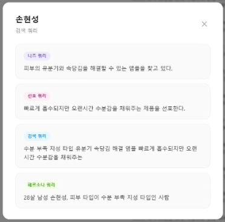
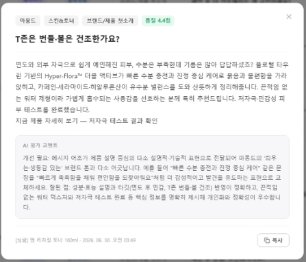

# AI Innovation Challenge 2026

**페르소나 기반 뷰티 상품 추천 및 CRM 메시지 자동 생성 시스템**

[](https://github.com/HyeonSeongSon/AI-INNOVATION-CHALLENGE-2026/actions/workflows/deploy.yml)


채팅으로 "특정 페르소나에게 이 상품의 홍보 메시지를 만들어줘"라고 요청하면, LangGraph
멀티에이전트 백엔드가 ① 요청을 분석·라우팅하고 ② OpenSearch 하이브리드 검색으로 페르소나에
맞는 상품을 추천하며 ③ 마케팅 메시지를 생성하고 ④ 3단계 품질 검사를 통과한 메시지만
저장합니다. 응답은 SSE로 실시간 스트리밍됩니다.

---

## 데모


*채팅 입력 → SSE로 노드 진행 상황 실시간 출력 → 페르소나 맞춤 상품 3개 추천 → CRM 메시지 생성 (중간 구간 배속)*

| 페르소나 관리 | 생성 메시지 이력 |
|---|---|
|  |  |
| 텍스트·파일로 페르소나 등록, 업로드 진행률 SSE 스트리밍 | 품질 검사를 통과한 메시지와 점수 이력 |

---

## 해결하려는 문제

CRM 마케팅은 "누구에게, 어떤 상품을, 어떤 말로" 알릴지를 페르소나마다 다시 정해야 합니다.
페르소나와 상품이 늘어나면 조합이 곱으로 불어나고, 사람이 쓰는 이상 메시지의 톤과 품질을
일정하게 유지하기도 어렵습니다.

이 프로젝트는 그 과정을 자동화하면서, **"자동 생성된 추천과 메시지를 신뢰할 수 있는가"** 를
함께 풀었습니다. 추천은 *잘 되는지 판단할 기준 자체가 없다* 는 문제에서 출발해 평가 체계를
직접 설계했고, 메시지는 3단계 품질 검사를 통과한 것만 저장합니다.

---

## 검증 결과 요약

| 축 | 지표 | 결과 |
|---|---|---|
| **검색 품질** | Hit@3 / MRR | 0.33 → **0.85** / 0.29 → **0.72** ([상세](#1-검색-품질-평가)) |
| **추천 품질** | 평가자 간 일치도 (Fleiss' κ) | **0.64**, 완전 합의율 87.9% ([상세](#2-추천-품질-평가)) |
| **부하 안정성** | 동시 100 사용자 완료율 | **100%** — p50 202.5s / p99 323.3s, 22회 반복 검증 ([상세](#3-부하-테스트)) |

---

## 목차

- [주요 기능](#주요-기능)
- [시스템 아키텍처](#시스템-아키텍처)
- [기술 스택](#기술-스택)
- [실행 & 배포](#실행--배포)
- [주요 워크플로우](#주요-워크플로우)
- [평가 & 성능 검증](#평가--성능-검증)
- [API & 프로젝트 구조](#api--프로젝트-구조)
- [문서 안내](#문서-안내)
- [개발 가이드](#개발-가이드)

---

## 주요 기능

- **페르소나 기반 상품 추천** — 멀티벡터 retrieval + 페르소나 3차원(need/preference/persona) 병렬 하이브리드 검색을 **RRF(Reciprocal Rank Fusion)**로 융합하여 top-3 추천
- **하이브리드 검색** — OpenSearch BM25(nori 한국어 형태소) + KNN(`KURE-v1` 임베딩) 결합
- **CRM 메시지 생성** — LangGraph 멀티에이전트(Supervisor 패턴) 기반 자동 생성
- **3단계 품질 검사** — Rule(길이·금칙어) → Semantic 유사도(KNN) → LLM-as-a-Judge, 실패 시 피드백 재생성
- **데이터 등록 파이프라인** — 페르소나·상품을 텍스트/파일로 등록(백그라운드 잡 + SSE 진행 스트리밍)
- **인증/보안** — JWT(HttpOnly Cookie) + 서비스 간 `INTERNAL_TOKEN` + 단명 User Assertion JWT, PostgreSQL 기반 Rate Limiter
- **실시간 스트리밍** — `/chat/v2/stream` SSE로 노드 진행 상황·토큰·결과를 점진 전달

---

## 시스템 아키텍처

논리적으로 **5개의 FastAPI 마이크로서비스**(API Gateway·CRM·Recommend·Generate·Data
Registration) + **DB API** + **OpenSearch API**로 구성됩니다.

| 서비스 | 포트 | 진입점 | 노출 |
|--------|------|--------|------|
| API Gateway (Auth + BFF Proxy) | 8005 | `backend/main.py` | **외부 공개** |
| CRM Service (Supervisor 오케스트레이터) | 8006 | `backend/servers/crm_server.py` | 내부 |
| Recommend Agent | 8001 | `backend/servers/recommend_server.py` | 내부 |
| Generate Agent | 8002 | `backend/servers/generate_server.py` | 내부 |
| Data Registration Agent | 8003 | `backend/servers/data_registration_server.py` | 내부 |
| Database API | 8020 | `database/api_server.py` | 내부 |
| OpenSearch API | 8010 | `opensearch/opensearch_api.py` | 내부 |
| Frontend | 3000 | `frontend/` | 외부 공개 |

```
┌──────────────┐
│   Client     │  (SSE 스트리밍)
└──────┬───────┘
       ▼
┌─────────────────────────────────────────────────────────┐
│  API Gateway :8005  (JWT 인증 · Rate Limit · BFF 프록시)  │
└──────┬───────────────────────────────────┬──────────────┘
       │ X-Internal-Token + X-User-Assertion│ (DB 프록시)
       ▼                                     ▼
┌─────────────────────────────┐      ┌────────────────────┐
│  CRM Service :8006          │      │  Database API :8020│
│  (Supervisor 오케스트레이터) │◄────►│  (PostgreSQL)      │
│    │ A2A                    │      └────────────────────┘
│    ├─ Recommend Agent :8001 │
│    ├─ Generate Agent  :8002 │─────►┌──────────────────────────┐
│    └─ Data Reg Agent  :8003 │      │  NLB → OpenSearch API    │
└─────────────────────────────┘      │  :8010 (ASG) → 엔진 :9200│
                                      └──────────────────────────┘
```

> **로컬**: 4개 Docker Compose 스택이 `msa-net` 브리지 네트워크에서 컨테이너명으로 통신하며,
> 외부 노출은 Gateway(8005)·Frontend(3000)뿐입니다.
> **프로덕션(AWS)**: 앱 5종은 ECS Fargate(Cloud Map DNS), DB·OpenSearch 엔진은 EC2,
> OpenSearch API는 ASG+NLB로 수평 확장되며, 진입점은 CloudFront 하나입니다.
> 상세는 [README.detailed.md](README.detailed.md) 2·11장 참고.

---

## 기술 스택

| 영역 | 기술 |
|------|------|
| 언어 | Python 3.11 (백엔드/DB/검색), JavaScript (프론트엔드) |
| 백엔드 | FastAPI, LangGraph, LangChain, A2A(Agent-to-Agent) 커스텀 프로토콜 |
| LLM | OpenAI(`gpt-5-mini` / `gpt-5-nano` 기본값), Anthropic Claude·Google Gemini 선택 (`ALLOWED_MODEL_PREFIXES` 화이트리스트) |
| 임베딩 | `nlpai-lab/KURE-v1` (SentenceTransformer, 한국어) |
| 벡터 검색 | OpenSearch (BM25 + KNN 하이브리드, nori 형태소 분석) |
| RDB | PostgreSQL 14+ (SQLAlchemy 2.0 ORM) |
| 체크포인터 | LangGraph `AsyncPostgresSaver` (PostgreSQL) |
| 인증 | JWT(HttpOnly Cookie) + `INTERNAL_TOKEN` + User Assertion JWT |
| 프론트엔드 | React 19, Vite 7, React Router 7, styled-components, axios |
| 관측성 | structlog(JSON 구조화 로그), LangSmith 트레이싱(선택) |
| 인프라(프로덕션) | AWS — CloudFront+S3(프론트), ALB+ECS Fargate(앱 5종), EC2(DB·OpenSearch 엔진), ASG+NLB(OpenSearch API), Terraform, GitHub Actions OIDC |
| 인프라(로컬) | Docker Compose(모듈별) + Nginx(프론트 정적 서빙) |

---

## 실행 & 배포

프로덕션 AWS 환경이 이 프로젝트의 기준 환경입니다.
`main` 푸시 시 GitHub Actions(`deploy.yml`)가 ECR 이미지 빌드 → ECS 롤링 배포까지 자동
수행합니다.

- **배포 런북** (0에서 운영 배포까지): [infra/DEPLOYMENT_GUIDE.md](infra/DEPLOYMENT_GUIDE.md)
- **로컬 개발 환경 구성**: [README.detailed.md](README.detailed.md) 14장
- **DB 초기화 및 색인**: [database/SETUP_GUIDE.md](database/SETUP_GUIDE.md)

---

## 주요 워크플로우

### CRM 메시지 생성 (SSE)

```
POST /api/marketing/chat/v2/stream
    ↓
[Gateway :8005] JWT 인증 + chat Rate Limit → X-User-Assertion 발급 → CRM 릴레이
    ↓
[CRM Supervisor :8006] maybe_summarize → supervisor_agent
  LLM(with_structured_output)이 task_plan(에이전트 실행 순서)을 한 번에 결정
    ↓
[Recommend Agent :8001]  (A2A)
  검색 쿼리 조회/생성 → OpenSearch 하이브리드 검색
  → 멀티벡터 retrieval(top-100) → 3차원 병렬 검색 → RRF 융합 → top-3
    ↓
[Generate Agent :8002]  (A2A)
  메시지 생성 → 3단계 품질 검사(Rule → Semantic → LLM Judge)
  → 실패 시 피드백 재생성 루프
    ↓
[CRM Supervisor] 최종 응답 조합 → SSE(token/text_chunk/result/done)
    ↓
[저장] conversation_messages + generated_messages(품질 통과분) — best-effort
```

**SSE 이벤트 타입**: `node_start` / `token` / `text_chunk` / `text_done` / `log` /
`node_end` / `result` / `error` / `done`

> 단계별 상세와 프로덕션(AWS) 경로 차이는 [README.detailed.md](README.detailed.md) 8·11장 참고.

---

## 평가 & 성능 검증

추천 품질과 프로덕션 부하 안정성을 **정량 지표로 검증**했습니다. 특히 추천은 *"잘 되는지 판단할 기준 자체가 없다"* 는 문제에서 출발해, **정답이 명확한 검색 지표**와 **실사용에 가까운 LLM 채점**이라는 두 축으로 평가 체계를 직접 설계했습니다.

### 1. 검색 품질 평가

**상품 역추적 (Hit@3 · MRR)** — 정답을 명확히 만들기 위해 **상품을 먼저 정하고, 그 상품을 살 법한 페르소나를 역생성**한 뒤, 해당 페르소나로 검색했을 때 원래 상품이 상위에 오르는지를 측정했습니다. 정답이 분명해 검색 파이프라인 개선을 객관적으로 추적할 수 있습니다.

- **평가 스크립트**: [`eval/run_eval.py`](eval/run_eval.py) — Retrieval Hit@100 → 3차원 RRF top-N → Hit@N / Recall@N / MRR
- **Retrieval Hit@100**: 정답이 1차 검색에서 아예 누락되는지를 진단하는 **하한선** 지표

| 지표 | 개선 전 | **개선 후** |
|------|:---:|:---:|
| **Hit@3** | 0.33 | **0.85** |
| **MRR** | 0.29 | **0.72** |
| **Retrieval Hit@100** (1차 검색 재현율) | — | **100%** |

이 지표를 근거로 **BM25 + 벡터를 RRF로 융합한 하이브리드 검색**, **멀티벡터 인덱스**, **페르소나 다관점 쿼리 확장**을 도입해 개선을 확정했습니다.

### 2. 추천 품질 평가

**LLM-as-Judge + 평가자 간 일치도** — 역생성 페르소나는 상품 정보에서 파생된 만큼 실제 사용자의 표현과 다를 수 있어, 검색 지표를 곧 추천 품질로 볼 수는 없다고 판단했습니다. 그래서 **상품과 무관하게 랜덤 생성한 페르소나**에 대한 추천 적합도를 LLM이 1~5점으로 채점하는 평가를 추가했습니다.

정답이 없다는 한계를 보완하기 위해, **동일한 결과를 3명이 독립적으로 평가**하고 평가자 간 일치도를 측정해 **채점을 신뢰할 기준선**부터 확립했습니다.

- **평가셋**: 사람이 주석한 60개 페르소나 (`eval/human_annotated_eval_data_set.jsonl`)
- **일치도 분석**: [`eval/human_annotated/analyze_annotations.py`](eval/human_annotated/analyze_annotations.py) — Fleiss' Kappa · Gwet's AC1 · Krippendorff's Alpha

| 평가자 간 일치도 | 값 |
|------|:---:|
| 완전 합의율 (3인 일치) | **87.9%** |
| Fleiss' Kappa | **0.64** (유의미한 일치) |

이 기준선 위에서 임베딩 가중치와 top-k를 반복 실험하되, **평균 점수가 아니라 상위 순위일수록 적합도가 높아지는 정렬 품질**을 기준으로 최적 조합을 선택했습니다. 최종 채택 조합(`k=10`, weight_v4)은 전체 평균이 가장 높으면서 **rank1–rank5 격차도 가장 크게** 벌어졌습니다.

| 지표 | 초기 | 튜닝 중 | **최종 채택 (k=10, v4)** |
|------|:---:|:---:|:---:|
| **top-5 평균** | 3.634 | 3.662 | **3.694** |
| top-3 평균 | 3.961 | 3.867 | **3.939** |
| rank1 평균 | 4.083 | 4.067 | **4.167** |
| **rank1–rank5 격차** (정렬 품질) | +0.999 | +0.863 | **+1.031** |
| rank1–rank3 격차 | +0.133 | +0.250 | **+0.350** |

> 평균만 보면 차이가 작지만, 최종 조합은 **상위 순위일수록 점수가 단조 상승**하도록 정렬 품질을 끌어올린 것이 핵심입니다 (`gpt-5-mini` judge, N=60).

```bash
python eval/run_eval.py                              # 검색 품질 (Hit@3 · MRR · Retrieval Hit@100)
python eval/eval_recommendation_weights_v3.py        # 추천 가중치 LLM-as-Judge
python eval/human_annotated/analyze_annotations.py   # 평가자 간 일치도
```

### 3. 부하 테스트

`/api/marketing/chat/v2/stream` SSE 엔드포인트에 대해 **동시 100명 완료율 100%**를 목표로
18~39차(22회) 반복 검증했습니다.

| 항목 | 내용 |
|------|------|
| 목표 | `/chat/v2/stream` 동시 100 요청 완료율 100% |
| **기준 구성** | ECS recommend 3 / generate 2 / crm 1, opensearch-api ASG 2대<br>— 부하 대응 용량으로 산정, 평시에는 축소 운영(비용) |
| **진입 게이팅** | `chat_stream_max_concurrent=100` — 초과 요청은 최대 300s 대기 후 안내 응답 반환 |
| 최종(39차) | 완료율 **100%**, p50 **202.5s** / p99 **323.3s**, 실패·유실 0건 |
| 측정 경로 | VPC 내부 전용 EC2 → ALB (단일 Windows 클라이언트는 동시 220+에서 자체 붕괴) |
| 진행 | 0% → 63% → 87% → 100% (매 회차 가설→실측→원인확정→재검증) |
| 도구화 | `parse_results.py`(SSE 분류) → `fetch_metrics.py`(CloudWatch 수집) → `analyze_results.py`(PASS/FAIL 표) |

단계적으로 이동한 병목을 순차 제거했습니다 — OpenSearch 동시성 → 타임아웃 계층 역전 →
인스턴스 용량 → 임베딩 중복 호출 → SSE 데드라인 → LLM 레이트리밋 → 구조적 LLM 호출
보호(재시도+세마포어 9곳 일괄 적용).

> **p50 202.5s**는 멀티에이전트 순차 실행(라우팅 → 검색 → 추천 → 생성)에 품질 검사 실패 시
> 피드백 재생성 루프까지 포함한 시간입니다.
>
> **재현 시 주의**: ① 로그인은 rate limit 회피를 위해 8명씩 65초 간격 배치 처리해야 합니다.
> ② ASG 증설은 `Terminate` 프로세스를 `suspend-processes`로 중단한 뒤 수행해야 TargetTracking
> 스케일인에 되돌려지지 않습니다(37차에서 확립).

```bash
loadtest/run_chat_stream_test.sh                              # VPC 내부 EC2에서 실행
python loadtest/analyze_results.py <result_dir> <metrics_json>
```

상세는 [loadtest/README.md](loadtest/README.md) 참고.

---

## API & 프로젝트 구조

### 주요 엔드포인트 (Gateway :8005)

| 메서드 | 경로 | 역할 | 인증 |
|--------|------|------|------|
| POST | `/auth/login` | 로그인 → HttpOnly 쿠키 발급 | Rate Limit + 계정잠금 |
| POST | `/api/marketing/chat/v2/stream` | CRM 메시지 생성 (SSE 스트리밍) | JWT + chat Rate Limit |
| POST | `/api/pipeline/personas/create-from-file/upload` | 파일 페르소나 업로드 → job_id | JWT |
| GET/POST/PUT/DELETE | `/api/conversations*` | 대화 CRUD → DB 프록시 | JWT |
| GET | `/health` | DB·CRM·internal 클라이언트 상태 | — |

> 전체 엔드포인트 목록과 내부 서비스(CRM 8006 / DB API 8020 / OpenSearch API 8010) 상세는
> [README.detailed.md](README.detailed.md) 4·5·6장을 참고하세요.

### 디렉터리 구조

```
AI-INNOVATION-CHALLENGE-2026/
├── backend/      # FastAPI 백엔드 5종 — main.py(Gateway), servers/, a2a/, app/{api,agents,core,config}
├── database/     # PostgreSQL + Database API — api_server.py, routers/, migrations/, scripts/
├── opensearch/   # OpenSearch + 검색 API — opensearch_api.py, opensearch_hybrid.py, index_products_*.py
├── frontend/     # React 19 + Vite 7 — src/{pages,components,contexts}
├── eval/         # 추천·검색 품질 평가 — run_eval.py, human_annotated/, 평가 데이터셋
├── loadtest/     # 부하테스트 스크립트/결과 — run_chat_stream_test.sh, analyze_results.py
├── infra/        # 프로덕션 AWS 인프라 (Terraform) — bootstrap/, ec2/
└── .github/workflows/   # CI/CD (deploy.yml, snapshot.yml)
```

---

## 문서 안내

| 문서 | 내용 |
|------|------|
| **[README.detailed.md](README.detailed.md)** | 전체 아키텍처·백엔드/DB/검색/프론트 구조·요청 흐름·프로덕션 인프라·CI/CD 상세 (가장 상세한 레퍼런스) |
| [CLAUDE.md](CLAUDE.md) | 코딩 가이드라인 및 프로덕션 코드 패턴 |
| [infra/DEPLOYMENT_GUIDE.md](infra/DEPLOYMENT_GUIDE.md) | AWS 배포 런북 (0에서 운영 배포까지, GitHub Actions 자동 배포) |
| [infra/USER_CREATION_GUIDE.md](infra/USER_CREATION_GUIDE.md) | 배포 환경 admin/일반 유저 계정 생성 방법 |
| [database/SETUP_GUIDE.md](database/SETUP_GUIDE.md) | DB 초기화 및 데이터 색인 가이드 |
| [opensearch/README.md](opensearch/README.md) | OpenSearch 하이브리드 검색 시스템 상세 |
| [loadtest/README.md](loadtest/README.md) | `/chat/v2/stream` 동시성 게이팅 부하테스트 |

---

## 개발 가이드

### 브랜치 전략

개인 작업은 각자 브랜치에서 진행하고, `main`에는 병합된 최종 결과물만 올립니다.
`main` 푸시 시 GitHub Actions(`deploy.yml`)가 AWS로 전자동 배포합니다.

```bash
git checkout -b feature/your-feature-name
```

### 코딩 가이드라인

타입 안전성·비동기 일관성·에러 처리·LangGraph 노드 설계 등 프로덕션 코드 패턴은
[CLAUDE.md](CLAUDE.md)에 정리되어 있습니다.

---

## 문의

프로젝트 관련 문의사항은 이슈를 생성해주세요.
